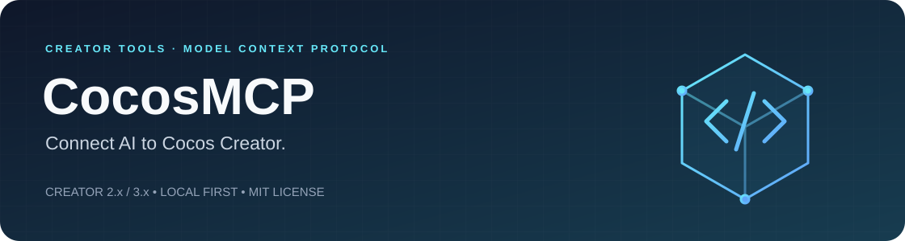

<p align="center">
  
</p>

<h1 align="center">CocosMCP</h1>

<p align="center">
  A free, MIT-licensed MCP implementation for Cocos Creator 2.x and 3.x.<br>
  Connect AI clients to your editor, project assets, and development runtime.
</p>

<p align="center">
  <strong>English</strong> · <a href="README.zh-CN.md">简体中文</a>
</p>

<p align="center">
  <a href="#quick-start">Quick start</a> ·
  <a href="#capabilities">Capabilities</a> ·
  <a href="#documentation">Documentation</a> ·
  <a href="#verification-and-safety">Verification &amp; safety</a>
</p>

<p align="center">
  
  <strong>Implemented entirely with Codex.</strong><br>
  All first-party code in this project is implemented using Codex. Third-party software and dependencies retain their own authorship and licenses.
</p>

---

## Why CocosMCP?

Work with scenes, nodes, components, assets, and runtime objects through structured MCP tools. CocosMCP runs locally, requires no CocosMCP account, and imposes no tool-call quotas. Your AI client's own requirements and limits still apply.

The repository includes separate Creator 2.x and 3.x extensions, a standalone MCP service, a capability catalog, and a development runtime bridge. Registered operations span **54 functional modules**; registration, implementation, and verification are reported separately, so coverage is not a claim that every feature is complete.

## Capabilities

| | Area | What you can do |
| :---: | --- | --- |
|  | **Editor & assets** | Work with scenes, nodes, components, prefabs, selection, undo, and logs. Plan asset organization before applying changes. |
|  | **Development runtime** | Inspect object handles, use events, pause/resume, capture screenshots, and query available metrics through a guarded development bridge. |
|  | **Workflows & builds** | Validate multi-step plans, execute sequentially, compare scene snapshots, and manage Creator CLI build jobs. |
|  | **Shaders & materials** | Use Creator 3.8.8 native Effect compilation, dependency fingerprints, hash-guarded edits, material instances, macro variants, and RenderTexture previews. |

- **Local MCP transports:** stdio and authenticated Streamable HTTP.
- **Dockable control center:** project and editor instance information, capabilities, bridge logs, runtime state, and bridge start/stop controls. The panel supports Simplified Chinese and English, defaults to Chinese, and saves the preference per project. Logs retain their original text and support copying errors.
- **Inspectable changes:** `scene.snapshot` and `scene.diff` provide baselines and recursive `added`, `removed`, and `changed` path records for nodes, components, properties, and arrays.
- **Recoverable status:** workflow status and build-job indexes persist under the target project's `.codex-work/cache/cocos-mcp/`. A build still running at service restart is marked as failed with unknown state instead of permanently blocking the project.
- **Operation tracking:** explicit `operationId` values support in-process idempotent reuse; query completed results with `cocos_operation_query`. Audit logs record operation metadata only.
- **Source discovery:** generate editor-message/type candidates from Creator source or ASAR, or an `engine-capabilities.json` catalog from engine source. Candidates remain `source-only` until separately verified.

Version support is operation-specific. Inspect `creator2Operations`, `creator3Operations`, and each capability's verification evidence before use; unsupported versions are rejected before execution. See the [feature reference](docs/feature-reference.md) and [Shader guide](docs/shader-development.md).

## Quick start

### 1. Install and build

Use **Node.js 24+**, **pnpm 11** (the repository pins the exact version in `package.json`), and an existing Cocos Creator project.

```bash
pnpm install
pnpm check
```

`pnpm check` runs type checking, builds, and tests. Project configuration keeps build and test output under `.codex-work/`.

### 2. Install the editor extension

Use your own project and editor paths. This example targets Creator 3.8.8 on macOS:

```bash
pnpm start install \
  --project /path/to/my-cocos-project \
  --creator /Applications/Cocos/Creator/3.8.8/CocosCreator.app
```

| Editor | Extension location in the target project |
| --- | --- |
| Creator 2.x | `packages/cocos-mcp-creator2/` |
| Creator 3.x | `extensions/cocos-mcp-creator3/` |

The installer backs up an existing extension of the same name. Open the project in Creator, load the extension, and open the **CocosMCP** control center from the editor menu. The MCP service discovers protected instance descriptors and routes requests by project, editor version, and instance ID.

### 3. Check the connection and start MCP

```bash
# Inspect the environment, editor instances, and module coverage.
pnpm start doctor --project /path/to/my-cocos-project

# Start stdio transport for an MCP client.
pnpm start serve --project /path/to/my-cocos-project

# Or start local Streamable HTTP on an automatically assigned port.
pnpm start serve --project /path/to/my-cocos-project --transport http --port 0
```

HTTP binds only to `127.0.0.1`, requires a Bearer token, and rejects non-local Host/Origin values. The token is stored in the target project's `.codex-work/cache/cocos-mcp/mcp-http-token`.

For client configuration and troubleshooting, see the [user guide](docs/user-guide.md) (Chinese).

## Plan a workflow

Pass a sequence like this to `cocos_workflow_plan`, replacing the scene URL with an existing scene in your project:

```json
{
  "projectId": "<project-id>",
  "steps": [
    { "capabilityId": "scene.open", "params": { "uuid": "db://assets/main.scene" } },
    { "capabilityId": "node.create", "params": { "name": "LoginPanel" } },
    { "capabilityId": "scene.save", "params": {} }
  ]
}
```

Planning checks parameters, versions, risks, and side effects. Use `cocos_workflow_execute` after the plan is valid and any required authorization is in place. Execution stops on failure by default and returns completed steps and compensation hints. There is no universal rollback: use each capability's `rollback` guidance. Query persisted progress with `cocos_workflow_status` after a service restart.

## Verification and safety

The `verification` field describes the evidence behind a capability:

| Level | Evidence |
| --- | --- |
| `source-only` | Discovered from source, declarations, or ASAR analysis only |
| `unverified` | Registered without completed automated verification |
| `contract-tested` | Parameter and protocol contract tests passed |
| `adapter-tested` | Mock editor/runtime adapter tests passed |
| `editor-verified` | Verified in a real Creator editor project |
| `runtime-verified` | Verified in a real development runtime |
| `device-verified` | Verified on the target device or platform |

`cocos_coverage` reports registered, implemented, planned, and verified counts separately. Automated checks cover schemas, path safety, the capability catalog, and runtime policies. Passing `pnpm check` does **not** establish complete Creator 2.4.15/3.8.8 editor, device, platform SDK, or GPU acceptance; those require corresponding real-environment checks.

The runtime bridge is restricted to loopback connections and development builds. Property paths, method paths, and argument counts are validated; dangerous host entry points are rejected. Project-code execution and arbitrary editor-message calls require the explicit startup flag `--allow-project-code`.

Before creating assets, query `asset.location` and reuse the returned directory. For asset organization, review `asset.organize.plan` and apply it with the same parameters and `planHash`; existing asset moves must use AssetDB to preserve metadata. See [asset organization](docs/asset-organization.md).

## Development

```bash
# Rebuild the service, extensions, and runtime bridges.
pnpm build

# Discover Creator editor-message and type candidates.
pnpm start catalog --project /path/to/project --creator /Applications/Cocos/Creator/3.8.8/CocosCreator.app

# Analyze engine source and generate engine-capabilities.json.
pnpm start catalog --project /path/to/project --engine /path/to/cocos-engine
```

Build output:

```text
.codex-work/build/
├── server/cli.mjs
├── extensions/creator2/
├── extensions/creator3/
└── runtime/
```

## Documentation

The detailed guides below are currently written in Chinese. Both README editions cover the same introduction and setup flow.

| Guide | Contents |
| --- | --- |
| [User guide](docs/user-guide.md) | Installation, startup, client configuration, and examples |
| [Feature reference](docs/feature-reference.md) | Capabilities by domain and version limits |
| [Implementation & acceptance](docs/implementation-guide.md) | Architecture, version differences, safety, and real-environment checks |
| [Scene production & preview](docs/scene-production.md) | Creator 3.8.8 geometry, arrays, rendering, preview windows, and screenshots |
| [Shader development](docs/shader-development.md) | Native Effect compilation, materials, and validation boundaries |
| [Asset organization](docs/asset-organization.md) | Directory reuse, organization plans, and guarded asset moves |
| [Proposal](docs/cocos-mcp-proposal.md) · [Roadmap](docs/capability-roadmap.md) | Project scope and phased implementation |
| [Verification checklist](docs/capability-verification.md) · [Implementation notes](docs/roadmap-implementation.md) | Completion evidence, added capabilities, and examples |

## License

First-party code is licensed under **MIT**. Cocos Creator, the engine, Spine, DragonBones, platform SDKs, and other third-party dependencies remain subject to their respective licenses.
