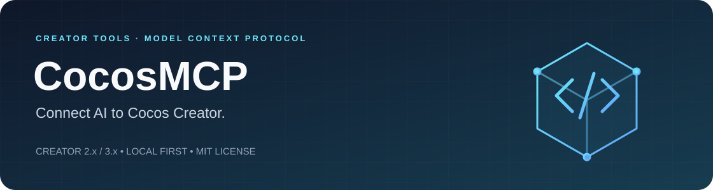

<p align="center">
  
</p>

<h1 align="center">CocosMCP</h1>

<p align="center">
  A free, MIT-licensed MCP implementation for Cocos Creator 2.x and 3.x.<br>
  Connect AI clients to your editor, project assets, and development runtime.
</p>

<p align="center">
  <strong>English</strong> · <a href="README.zh-CN.md">简体中文</a>
</p>

<p align="center">
  <a href="#let-ai-download-and-install-automatically-recommended">AI installation</a> ·
  <a href="#quick-start">Quick start</a> ·
  <a href="#supported-features-by-creator-version">Version support</a> ·
  <a href="#mcp-feature-overview">Features</a> ·
  <a href="#documentation">Documentation</a> ·
  <a href="#verification-and-safety">Verification &amp; safety</a>
</p>

<p align="center">
  
  <strong>Implemented entirely with Codex.</strong><br>
  All first-party code in this project is implemented using Codex. Third-party software and dependencies retain their own authorship and licenses.
</p>

---

## Why CocosMCP?

Work with scenes, nodes, components, assets, and runtime objects through structured MCP tools. CocosMCP runs locally, requires no CocosMCP account, and imposes no tool-call quotas. Your AI client's own requirements and limits still apply.

The repository includes separate Creator 2.x and 3.x extensions, a standalone MCP service, a capability catalog, and a development runtime bridge. Registered operations span **54 functional modules**; registration, implementation, and verification are reported separately, so coverage is not a claim that every feature is complete.

See the [Creator 2.4.15 implementation and acceptance record](docs/creator2-implementation.md) (Chinese) for the independent test project, native coverage, and remaining limitations.

## MCP feature overview

A compact overview of implemented MCP entry points. Exact version support, prerequisites, and verification levels are documented in the version table below and the [feature reference](docs/feature-reference.md).

| Editor & assets | Runtime & interaction | Workflows & diagnostics |
| --- | --- | --- |
| **Scenes**<br>Create, open, save, inspect hierarchy | **Object inspection**<br>Hierarchy, properties, object handles | **Projects & instances**<br>Projects, editors, runtime sessions |
| **Nodes**<br>Create, duplicate, reparent, delete, transform | **Runtime controls**<br>Pause, resume, inspect state | **Capability discovery**<br>Search, schemas, versions, coverage |
| **Components**<br>Find types, add, configure, reset | **Controls & input**<br>Control actions, mouse, keyboard, touch | **Workflow orchestration**<br>Validate plans, sequence steps, bind results |
| **Asset operations**<br>Query, import, save, move, resolve UUIDs | **Animation & actions**<br>Playback, track sampling, Tweens (2.x) | **Preview & captures**<br>Start/stop, screenshots, viewport checks |
| **Asset organization**<br>Locate folders, preview plans, apply moves | **Skeleton animation**<br>Spine playback/skins, DragonBones (2.x) | **Logs & diagnostics**<br>Bridge, preview, native console (3.x) |
| **Prefabs**<br>Create, instantiate, apply, revert | **Maps & physics**<br>Read/edit tiles, raycasts, contact queries | **Performance sampling**<br>Frame times, P99, budgets, render metrics |
| **UI composition**<br>Declarative creation, updates, layout/events | **Cameras & rendering**<br>Coordinate conversion, visibility, diagnostics | **Build jobs**<br>Start, status, logs, list, cancel |
| **Materials & Shaders**<br>Properties, macros, backups, native compile (3.x) | **Media & particles**<br>Audio/video playback, basic particle controls | **Artifact checks**<br>Build files, sizes, content hashes |
| **Clips & templates**<br>Edit clips/keyframes, component templates (3.x) | **Runtime assets**<br>Load, preload, release references, inspect Bundles | **Recovery queries**<br>Operation results, workflow progress, build records |
| **Scene & reference checks**<br>Snapshot diffs, missing components, dependencies | **Events & tasks**<br>Subscriptions, bounded sampling, poll/cancel tasks | **Visual & layout checks**<br>UI geometry, bounds, Shader preview comparisons |

Find entry points with `cocos_capability_search` / `cocos_capability_describe`, then call them through `cocos_capability_execute`. Workflows and builds also provide dedicated MCP tools.

## Supported features by Creator version

The exact adaptation baselines are **Creator 2.4.15** and **Creator 3.8.8**. This table describes implemented scope. Native evidence covers specific fixtures and parameters; it does not certify every feature, platform, or the entire engine. Other 2.x / 3.x versions do not inherit this support automatically.

| Feature | Creator 2.4.15 | Creator 3.8.8 |
| --- | --- | --- |
| Editor & assets | Scenes, nodes, components, Prefabs, undo/redo, AssetDB, organization, dependencies/users | Comparable core editing, plus native console queries and version-matched editor messages |
| UI & references | Declarative creation/updates, structural plans, scene/saved-file reference audits and deletion guards | Declarative creation/updates and layout/event checks; 2.x-specific structural/audit endpoints are not shared automatically |
| Controls & preview | Five semantic control adapters with real drag/click/text event tests; windows, captures, logs and sizing | Windows, captures, logs, mouse/keyboard/touch and viewport checks; native menu interaction records |
| Animation & actions | curveData editing/recovery; bounded sequential/parallel/repeated Tweens with cancellation and lifecycle checks | Native tracks, animation controls and animation-graph inspection; excludes 2.x-specific Tween task endpoints |
| Skeletons | Spine/DragonBones structure, cache boundaries, event tasks, real-time mixing and cleanup with native records | Spine playback/queues/skins/attachments and track sampling; does not inherit the 2.x cache/event/mixing evidence |
| Maps & physics | Orthogonal/isometric Tilemaps, ordinary collisions, body forces, joint inspection and Box contact tracing/cleanup | Tilemap and physics query/contact tools, subject to backend checks; separate native 3D CCT route records |
| Camera & rendering | 2D/3D coordinates, masks, 2D Graphics/Mask offscreen pixels and owned GPU-object deletion | Geometry/arrays/render settings, Shader RenderTexture previews, debug drawing, sorting, probes and IK |
| Shaders & materials | Effect source/backups, material properties/macros and runtime override recovery; no 3.x compiler | Native Effect compilation, dependency fingerprints, material instances, macro variants and preview comparisons |
| Resource lifecycle | Load/release, Bundle inspection, snapshots/diffs and multi-scene trends | Load/release and Bundle inspection; the 2.x snapshot/trend endpoints are not declared for 3.x |
| Gameplay templates | 2.x templates are not delivered yet | 13 editable templates, including controllers, cameras, virtual lists, dialogue and pools; not all gameplay paths accepted |
| Media & diagnostics | Basic audio/video/particle controls and UI/Label/atlas/Graphics diagnostics | Media, particles and performance/render diagnostics; platform experience and GPU performance need separate evidence |
| Workflows & builds | Local workflows and CLI jobs; recorded game-build environment failures remain | Local workflows, CLI jobs and artifact checks; signing, devices, SDKs and publication require separate acceptance |

As of 2026-10-08, the catalog contains **315 capability entries across 54 modules**. Creator 2.4.15 wires up to **123 editor + 106 runtime endpoints**, with another 11 handled or composed in the application layer; **276 entries apply to major version 3**. These are not current availability, native pass counts, or the default tool-list length. The latest regression passed **333 tests**. This batch was installed and tested in isolated projects for both versions; production game projects were not updated.

**Still incomplete:** additional 2.4.15 joints, Prefab differences/repair, image/font/atlas quality workflows, loading traces, TMX persistence, 2.x templates, material pipeline controls, focus/grid, single stepping/Scheduler, and other tracked work. The 2.4.15 game build still has recorded `exportSimpleProject` and FBX converter failures; building the plugin does not prove game export succeeds. The 3.8.8 post-processing and skinning paths also retain explicit limitations.

See the [version support matrix](docs/version-support.md), [2.4.15 adaptation record](docs/creator2-implementation.md), and [full acceptance tracker](docs/creator2-expansion-tracker.md) for details and evidence (Chinese).

### Preview reliability and acceptance (2026-10-08)

CP-001 through CP-013 are implemented: complete runtime bundles, scene/frame identity, focus before input, landscape/view restoration, loaded-byte refresh evidence, layered readiness, sanitized auditing, semantic clicks, acceptance recipes, guarded fixtures, and lifecycle regression. An earlier source snapshot passed 14 synthetic native checks per version. The latest snapshot passed 333 automated tests and 14/14 native checks on Creator 2; Creator 3 passed 12/14, with hidden-window input outcome unknown and the recipe failing its success assertion. This is not a full native pass for the current source. Launchers reuse local credentials and existing sessions rather than creating a fresh login environment for every run.

Creator 2 scene loaded-byte proof may still be unknown. External Chrome MCP integration, physical devices, GPU memory, and real matchmaking/payment flows remain unverified. See the [preview acceptance guide](docs/preview-acceptance.md) for examples, reproduction steps, and evidence boundaries (Chinese).

## Capabilities

- **Local MCP transports:** stdio and authenticated Streamable HTTP.
- **Dockable control center:** project and editor instance information, capabilities, bridge logs, runtime state, and bridge start/stop controls. The panel supports Simplified Chinese and English, defaults to Chinese, and saves the preference per project. Logs retain their original text and support copying errors.
- **Inspectable changes:** `scene.snapshot` and `scene.diff` provide baselines and recursive `added`, `removed`, and `changed` path records for nodes, components, properties, and arrays.
- **Recoverable status:** workflow status and build-job indexes persist under the target project's `.codex-work/cache/cocos-mcp/`. A build still running at service restart is marked as failed with unknown state instead of permanently blocking the project.
- **Operation tracking:** explicit `operationId` values support in-process idempotent reuse; query completed results with `cocos_operation_query`. Audit logs record operation metadata only.
- **Source discovery:** generate editor-message/type candidates from Creator source or ASAR, or an `engine-capabilities.json` catalog from engine source. Candidates remain `source-only` until separately verified.

Version support is operation-specific. Inspect `creator2Operations`, `creator3Operations`, and each capability's verification evidence before use; unsupported versions are rejected before execution. See the [feature reference](docs/feature-reference.md) and [Shader guide](docs/shader-development.md).

## Download and offline installation

### Let AI download and install automatically (recommended)

Send the prompt below to an **AI assistant with network, local filesystem, terminal, and desktop access**. You do not need to download files, locate paths, or fill in configuration first. The assistant discovers the target from your workspace and local environment, then downloads, installs, starts, and verifies the connection. This route needs network access; manual offline ZIP instructions follow.

<details>
<summary>Expand and copy: let AI handle the entire CocosMCP installation</summary>

```text
Download CocosMCP from GitHub, install it, and connect this AI client to my Cocos Creator project.
Repository: https://github.com/iEfoam/CocosMcp
Releases: https://github.com/iEfoam/CocosMcp/releases

Prioritize convenience. Handle discovery, downloads, installation, configuration, startup and verification yourself.
Do not ask me to download files, fill in paths, copy tokens, run commands or click through a tutorial.
Use your available tools to perform the installation, rather than just describing steps.

1. Identify the target project, exact Creator version/path, OS/architecture, current AI client and MCP configuration
   from the workspace, open Creator project and client context. Prefer the current project; do not modify other projects.
   Ask a brief question only if the target remains genuinely ambiguous.
2. Query this repository's GitHub Releases, using the API and pagination when needed. Do not guess download URLs.
   Prefer a stable release with complete installation assets; otherwise use the latest complete development prerelease
   and report that choice. Download the matching Creator-major ZIP, SHA256SUMS and release-manifest.json
   from the same release into the project's .codex-work/downloads/. Verify hashes, versions and package identity.
   Do not install if verification fails.
3. Discover and verify a standalone Node.js 24+. If missing, download an appropriate current Node 24.x LTS
   distribution from the official Node.js site for this OS/architecture, verify it and preferably extract it
   under the project's .codex-work/. Avoid changing system Node or requiring manual installation;
   request necessary system authorization only when required.
4. Preserve .gitignore rules and ensure .codex-work/ is ignored. Stage/extract inside the project and reject escaping paths.
   Stop this extension's own MCP service and unload/reload the target extension using available tools.
   Never force-close an editor with unsaved work. Back up the old extension under .codex-work/build/extension-backups/.
   Install Creator 2 into packages/cocos-mcp-creator2/ with package name cocos-mcp-creator2;
   install Creator 3 into extensions/cocos-mcp-creator3/ with package name cocos-mcp-creator3.
   Place package.json directly in the extension root. Do not modify game assets/scripts/scenes or other extensions.
5. Write service-config.json beside package.json, setting nodeExecutable to the verified absolute Node path.
   Use the bundled service; do not clone source or install npm/pnpm dependencies.
6. Use desktop/editor tools to open the project, load the extension and start MCP from its control center.
   Read the actual HTTP endpoint and local Bearer token yourself. Back up and merge this AI client's Streamable HTTP
   configuration, preserving other connections. Never print the token in chat or commit it to Git.
   Do not guess ports or configuration formats. Reload the connection using the client's supported mechanism;
   prefer project-scoped settings.
7. Actually call cocos_projects and cocos_instances to verify the intended project and editor instance.
   Finish with the installed version, project, verification result and backup location.
   If permissions, client capabilities or unsaved work block automation, complete independent steps first,
   then report only the concrete blocker and minimum required authorization. Do not hand the entire installation
   back to me or claim an unverified connection succeeded.
```

</details>

### Manual download and offline installation

Prebuilt packages require no source checkout, pnpm installation, or compilation. Choose a version on [GitHub Releases](https://github.com/iEfoam/CocosMcp/releases), then download the matching ZIP and `SHA256SUMS` from **Assets**. You can transfer these files to an offline computer. **Pre-release** entries are development builds: select them manually; the stable updater does not automatically install them.

| Release asset | Purpose |
| --- | --- |
| `cocos-mcp-creator2.zip` / `cocos-mcp-creator3.zip` | **Choose a ZIP for manual installation**, matching Creator 2 / 3 |
| `SHA256SUMS` / `release-manifest.json` | File checksums; versions, build IDs, and source fingerprint |
| `*.full.json` / `cocos-mcp-creator{2,3}.json` | Full / required-runtime updater bundles; legacy seven-file Creator 2 updaters need a full upgrade; not directly installable editor packages |
| GitHub-generated `Source code` archives | Repository source; follow Quick start below to build it |

### Install a ZIP manually

1. Have the matching **Cocos Creator and Node.js 24+** installed locally. The adaptation baselines are 2.4.15 / 3.8.8. Do not install both major-version packages into one project.
2. Compare the ZIP's SHA-256 with its entry in the same release's `SHA256SUMS`, using a local tool such as `shasum -a 256 <ZIP-path>` on macOS/Linux or `Get-FileHash <ZIP-path> -Algorithm SHA256` in PowerShell. Before upgrading, stop this project's MCP service, close Creator, and back up its existing extension under `.codex-work/build/extension-backups/`.
3. Extract the ZIP contents into the matching directory below. **`package.json` must be directly inside that directory**, without an extra enclosing folder. Do not put the extension in `assets/`.

| Creator | Installation directory within the project |
| --- | --- |
| 2.x | `<project>/packages/cocos-mcp-creator2/` |
| 3.x | `<project>/extensions/cocos-mcp-creator3/` |

4. Create `service-config.json` alongside the extension's `package.json`. Check `node --version`, then use `node -p "process.execPath"` to find the absolute Node executable path. Insert that path below; escape Windows backslashes as required by JSON:

```json
{
  "nodeExecutable": "/absolute/path/to/node"
}
```

Release ZIPs intentionally omit this machine-specific file. Use a separately installed Node.js 24+, not Creator's embedded Node. The offline ZIP installation does not need a source `buildRoot`.

5. Open the project, confirm the extension is loaded in the extension manager, and choose **CocosMCP → Open Control Center → Start MCP Service**. This also starts the editor bridge. Game preview and runtime integration remain separate steps.
6. Add a **Streamable HTTP MCP** connection in your AI client using the actual `http://127.0.0.1:<port>/mcp` address shown in the panel and the Bearer token from `<project>/.codex-work/cache/cocos-mcp/mcp-http-token`. Ports may change after restart. Client configuration formats differ; use your client's HTTP MCP settings. Call `cocos_projects` and `cocos_instances` to verify the target project and editor instance.

“Offline” means plugin installation needs no dependency downloads; it does not guarantee that your AI model runs offline. Online update checks may fail without a network connection. For stdio-only clients, use the source installation below. To roll back, stop the service, close Creator, and replace the extension directory with its backup.

## Quick start

### 1. Install and build

Use **Node.js 24+**, **pnpm 11** (the repository pins the exact version in `package.json`), and an existing Cocos Creator project.

```bash
pnpm install
pnpm check
```

`pnpm check` runs type checking → build → tests → build; the final build embeds matching test evidence. Project configuration keeps build and test output under `.codex-work/`.

### 2. Install the editor extension

Use your own project and editor paths. This example targets Creator 3.8.8 on macOS:

```bash
pnpm start install \
  --project /path/to/my-cocos-project \
  --creator /Applications/Cocos/Creator/3.8.8/CocosCreator.app
```

| Editor | Extension location in the target project |
| --- | --- |
| Creator 2.x | `packages/cocos-mcp-creator2/` |
| Creator 3.x | `extensions/cocos-mcp-creator3/` |

The installer backs up an existing extension of the same name. Open the project in Creator, load the extension, and use **CocosMCP → Open Control Center** (打开控制中心). The menu order is **About CocosMCP → Open Control Center → Check for Updates**. About and updates have dedicated views; bridge start/stop controls live inside the control center. The MCP service discovers protected instance descriptors and routes requests by project, editor version, and instance ID.

### 3. Check the connection and start MCP

```bash
# Inspect the environment, editor instances, and module coverage.
pnpm start doctor --project /path/to/my-cocos-project

# Start stdio transport for an MCP client.
pnpm start serve --project /path/to/my-cocos-project

# Or start local Streamable HTTP on an automatically assigned port.
pnpm start serve --project /path/to/my-cocos-project --transport http --port 0
```

HTTP binds only to `127.0.0.1`, requires a Bearer token, and rejects non-local Host/Origin values. The token is stored in the target project's `.codex-work/cache/cocos-mcp/mcp-http-token`.

For client configuration and troubleshooting, see the [user guide](docs/user-guide.md) (Chinese).

## Plan a workflow

Pass a sequence like this to `cocos_workflow_plan`, replacing the scene URL with an existing scene in your project (`.scene` for Creator 3, `.fire` for Creator 2):

```json
{
  "projectId": "<project-id>",
  "steps": [
    { "capabilityId": "scene.open", "params": { "uuid": "db://assets/main.scene" } },
    { "capabilityId": "node.create", "params": { "name": "LoginPanel" } },
    { "capabilityId": "scene.save", "params": {} }
  ]
}
```

Planning checks parameters, versions, risks, and side effects. Use `cocos_workflow_execute` after the plan is valid and any required authorization is in place. Execution stops on failure by default and returns completed steps and compensation hints. There is no universal rollback: use each capability's `rollback` guidance. Query persisted progress with `cocos_workflow_status` after a service restart.

Steps support `paramRefs` for earlier results, `runtimeRef` for explicit preview session binding, and read-only `waitFor` conditions. Workflow IDs cannot be replayed. Keyboard input defaults to canvas focus; frame profiling reports warmup, P99, render dimensions and optional P95 budgets. Frame timeouts include game/Director pause states and never automatically resume the game. See the [reliability and performance guide](docs/mcp-reliability-and-performance.md) (Chinese).

## Verification and safety

The `verification` field describes the evidence behind a capability:

| Level | Evidence |
| --- | --- |
| `source-only` | Discovered from source, declarations, or ASAR analysis only |
| `unverified` | Registered without completed automated verification |
| `contract-tested` | Parameter and protocol contract tests passed |
| `adapter-tested` | Mock editor/runtime adapter tests passed |
| `editor-verified` | Verified in a real Creator editor project |
| `runtime-verified` | Verified in a real development runtime |
| `device-verified` | Verified on the target device or platform |

`cocos_coverage` reports registered, implemented, planned, and verified counts separately. Automated checks cover schemas, path safety, the capability catalog, and runtime policies. Passing `pnpm check` does **not** establish complete Creator 2.4.15/3.8.8 editor, device, platform SDK, or GPU acceptance; those require corresponding real-environment checks.

The runtime bridge is restricted to loopback connections and development builds. Property paths, method paths, and argument counts are validated; dangerous host entry points are rejected. Project-code execution and arbitrary editor-message calls require the explicit startup flag `--allow-project-code`.

Before creating assets, query `asset.location` and reuse the returned directory. For asset organization, review `asset.organize.plan` and apply it with the same parameters and `planHash`; existing asset moves must use AssetDB to preserve metadata. See [asset organization](docs/asset-organization.md).

## Development

```bash
# Rebuild the service, extensions, and runtime bridges.
pnpm build

# Discover Creator editor-message and type candidates.
pnpm start catalog --project /path/to/project --creator /Applications/Cocos/Creator/3.8.8/CocosCreator.app

# Analyze engine source and generate engine-capabilities.json.
pnpm start catalog --project /path/to/project --engine /path/to/cocos-engine
```

Build output:

```text
.codex-work/build/
├── server/cli.mjs
├── extensions/creator2/
├── extensions/creator3/
└── runtime/
```

## Documentation

The detailed guides below are currently written in Chinese. Both README editions cover the same version support and setup flow. Local reports under `.codex-work/` are ignored by Git; linked guides provide reproduction scripts and evidence boundaries.

| Guide | Contents |
| --- | --- |
| [Version support](docs/version-support.md) · [Creator 2 acceptance](docs/creator2-expansion-tracker.md) | Exact-version feature matrix, native evidence and remaining scope |
| [User guide](docs/user-guide.md) | Installation, startup, client configuration, and examples |
| [Feature reference](docs/feature-reference.md) | Capabilities by domain and version limits |
| [2D development](docs/2d-development.md) · [Delivery & verification](docs/2d-implementation.md) | SpriteFrame, animation, UI, physics, Spine, Tilemap, and 13 editable gameplay templates for Creator 3.8.8 |
| [Implementation & acceptance](docs/implementation-guide.md) | Architecture, version differences, safety, and real-environment checks |
| [Scene production & preview](docs/scene-production.md) | Creator 3.8.8 geometry, arrays, rendering, preview windows, and screenshots |
| [Shader development](docs/shader-development.md) | Native Effect compilation, materials, and validation boundaries |
| [Asset organization](docs/asset-organization.md) | Directory reuse, organization plans, and guarded asset moves |
| [Preview acceptance](docs/preview-acceptance.md) · [Reliability](docs/mcp-reliability-and-performance.md) · [External connector](docs/external-preview.md) | CP-001–013, session reuse, real input, recipes/fixtures, refresh proof and reproduction |
| [Proposal](docs/cocos-mcp-proposal.md) · [Roadmap](docs/capability-roadmap.md) | Project scope and phased implementation |
| [Verification checklist](docs/capability-verification.md) · [Implementation notes](docs/roadmap-implementation.md) | Completion evidence, added capabilities, and examples |

## License

First-party code is licensed under **MIT**. Cocos Creator, the engine, Spine, DragonBones, platform SDKs, and other third-party dependencies remain subject to their respective licenses.
