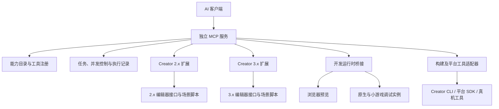

# CocosMCP 实施提案与完整功能清单

提案状态：设计基线（部分内容已落地）。本文保留原始方案与调研依据；2026-09-18 当前范围见 [版本矩阵](version-support.md)、[2.4.15 台账](creator2-expansion-tracker.md)，安装与架构见 [实施指南](implementation-guide.md)。本文不代表所有功能已经实现或通过真实运行验收。

调研基准：参考项目公开源码、Cocos Creator 2.4.15／3.8.8 引擎源码、官方扩展文档，以及本机安装的 Creator 3.8.8 编辑器包。

## 1. 项目定位与总体方案

项目定位为：**免费开源、无功能分级、无调用配额，覆盖 Cocos Creator 2.x／3.x 的编辑器操作、引擎运行时操作、资源生产和构建调试的完整 MCP 平台。**

技术上采用 **独立 MCP 服务 + 两套 Creator 编辑器扩展 + 两套运行时桥接 + 版本化能力目录**。其中，能力目录负责回答“某个版本、某个平台到底支持什么”，也作为最终验收依据。

原始提案阶段仅进行只读调研；随后两条版本线已取得部分原生编辑器/开发预览证据，最近代码回归为 249 项。这些后续证据不代表全功能、成功游戏构建或真机验收。

## 2. 已核实的调研结论

| 已核实的事实 | 对项目的影响 |
|---|---|
| 参考项目 `package.json` 声明 `editor >=3.8.6` | 其公开代码不能直接提供完整的 2.x 适配 |
| README 同时介绍公开版和 Pro 版，二者功能不能混为一谈 | 以公开代码实际实现为参考，不能把 Pro 宣传算作已获得的实现 |
| README 禁止该项目代码及衍生代码商用、转售 | 为实现允许商用的免费开源项目，推荐独立实现，不直接复制或 fork 后更换许可证 |
| 公开版 `scene.ts` 的一个预制体创建方法明确标注为模拟实现，但返回成功 | 必须建立“实际执行、读回验证、持久化验证”的成功标准；这不代表该仓库所有预制体路径都没有实现 |
| 公开版构建工具存在仅打开面板、查询状态的实现 | 构建模块需要真正覆盖配置、执行、进度、失败诊断和产物验收 |
| 本机 3.8.8 场景模块注册 218 条消息，其中 59 条标为公开 | 全覆盖需要处理公开接口和内部接口；这些消息包含通知等内容，不能直接换算为功能数量 |
| 2.4 引擎包含 3D、骨骼动画、3D 粒子及物理模块 | 2.x 适配不能只实现 2D 功能 |

参考依据：

- [参考项目声明与许可证](https://github.com/DaxianLee/cocos-mcp-server)
- [插件版本要求](https://github.com/DaxianLee/cocos-mcp-server/blob/a5db895b3299dccd78979ca0268193e4b6ebf037/package.json)
- [模拟实现所在位置](https://github.com/DaxianLee/cocos-mcp-server/blob/a5db895b3299dccd78979ca0268193e4b6ebf037/source/scene.ts#L328)
- [构建工具实现](https://github.com/DaxianLee/cocos-mcp-server/blob/a5db895b3299dccd78979ca0268193e4b6ebf037/source/tools/project-tools.ts#L209)

## 3. “全功能覆盖”的定义与验收口径

**“所有支持的功能都实现”应当成为可核查的工程标准。**

不能预先宣布“50 个工具覆盖 99%”，也不能通过一个任意执行脚本的工具宣称完成全部能力。覆盖范围定义为以下四层：

| 覆盖层 | 完成要求 |
|---|---|
| 工作流覆盖 | 场景制作、UI 制作、动画编辑、资源导入、调试、构建等，可以通过 MCP 完成全过程 |
| 对象覆盖 | 当前版本的全部组件、资源类型、可操作对象及其可编辑属性，都进入能力目录 |
| API 覆盖 | 可调用的引擎 API、编辑器消息和原生桥接接口具有明确的参数、上下文与返回契约 |
| 环境覆盖 | 每项能力标明版本、平台、模块开关、设备要求和验证状态 |

能力状态分开记录：

- **实现状态**：未实现、已实现、待适配。
- **当前可用性**：可用、模块未启用、缺少运行实例、平台不支持。
- **验证状态**：源码确认、编辑器验证、运行时验证、真机验证。

例如，某个物理后端被项目裁剪，应显示“需要启用模块”；对应版本根本没有某项功能，则显示“不适用”。已经存在但尚未接入的能力必须保留在待办清单中，不能通过隐藏它提高覆盖率。

对每个认证环境分别计算：

```text
能力覆盖率 = 已实现且通过对应验收的适用能力数 / 全部适用能力数
```

对象属性、API 和工作流分别统计，避免大量简单属性掩盖少数关键工作流的缺失。

## 4. 总体架构与模块职责



推荐 TypeScript 实现服务及扩展，使用 pnpm workspace 管理多包。核心业务不直接引用 `Editor` 或 `cc`，通过接口调用版本适配器。

| 模块 | 职责 |
|---|---|
| `mcp-server` | MCP 协议、工具注册、资源读取、客户端兼容 |
| `contracts` | 参数、结果、错误码、对象引用、能力描述 |
| `capability-catalog` | 能力发现、版本匹配、模块条件和验证记录 |
| `application` | 场景、资源、动画、构建等用例编排 |
| `creator2-adapter` | 2.x 编辑器消息、AssetDB、撤销与场景脚本适配 |
| `creator3-adapter` | 3.x Message、AssetDB、撤销与场景脚本适配 |
| `runtime2-bridge` | 2.x 开发运行实例的对象、方法、事件及诊断 |
| `runtime3-bridge` | 3.x 开发运行实例的对应能力 |
| `native-adapters` | JSB、设备调试、原生构建与平台工具 |
| `catalog-generator` | 从源码、类型声明、消息描述生成候选能力 |
| `conformance-tests` | 跨版本契约测试、真实编辑器及运行时验收 |

**独立 MCP 服务是关键选择。**旧 Creator 内置的 Node/Electron 环境不适合直接承载持续升级的 MCP SDK。编辑器扩展保持轻量，编译到对应版本可运行的 JavaScript；现代协议、任务调度和复杂分析放在独立进程中。

安装体验可以做到“安装扩展，一键启动”：提供按操作系统和架构打包的服务程序，避免要求最终用户安装开发依赖。

协议方面使用官方 SDK，支持 stdio 和 Streamable HTTP。调研时官方 TypeScript SDK 已进入 v2 稳定线；2026-07-28 版 Streamable HTTP 移除了协议级 session，因此 **Creator 工程和实例标识必须由应用自己管理**。旧客户端通过独立兼容适配接入，不能继续硬编码参考项目中的旧协议版本。

- [SDK 说明](https://github.com/modelcontextprotocol/typescript-sdk)
- [2026-07-28 HTTP 传输规范](https://modelcontextprotocol.io/specification/2026-07-28/basic/transports/streamable-http)

## 5. Creator 2.x／3.x 适配策略

双版本支持需要明确处理以下差异，而不是在每个工具中零散判断版本。

| 差异 | Creator 2.x | Creator 3.x | 处理方式 |
|---|---|---|---|
| 项目扩展目录 | `packages/` | `extensions/` | 分别打包 |
| 扩展声明 | `main-menu`、`messages`、`scene-script` 等 | `contributions` 等 | 各自生成清单 |
| 编辑器通信 | `Editor.Ipc`、`Editor.Scene.callSceneScript` 等 | `Editor.Message.request` 等 | 统一成应用接口 |
| 场景引擎环境 | `cc` 等旧模块体系 | `cc` 模块体系 | 场景桥接分开实现 |
| UI 尺寸、锚点 | 大量属性直接在 Node 上 | 主要在 `UITransform` 上 | 对外提供明确的 UI 操作语义 |
| 透明度、颜色 | Node 等对象承担较多职责 | `UIOpacity`、渲染组件等 | 分属性映射，避免错误等价 |
| 分组与渲染层 | group、碰撞矩阵等 | layers、物理分组等 | 独立表达，不统一成含糊的 `layer` |
| 资源加载 | 早期 loader 与 2.4 Asset Manager 存在差异 | Asset Manager | 2.x 内部还需分适配阶段 |
| 动画数据 | 旧剪辑与曲线结构 | 新轨道、曲线、动画图等 | 语义操作共享，数据格式分开 |
| 预制体 | 旧序列化与同步机制 | 嵌套、覆盖、挂载等更复杂 | 使用对应版本的编辑与序列化路径 |
| 原生实现 | `engine-native` 独立仓库 | 引擎仓库中的 `native/` | 原生桥接与构建分别维护 |

官方文档已经明确提供两种场景脚本入口：

- [2.4 场景脚本](https://docs.cocos.com/creator/2.4/manual/zh/extension/scene-script.html)
- [3.8 场景脚本](https://docs.cocos.com/creator/3.8/manual/zh/editor/extension/scene-script.html)

引擎源码也直接体现了 [2.4 Node 属性](https://github.com/cocos/cocos-engine/blob/cbbfa85937965792f9188f44b13721905b08c090/cocos2d/core/CCNode.js) 与 [3.8 UITransform](https://github.com/cocos/cocos-engine/blob/411f98df047c25902f93440d4b22925c2fb65461/cocos/2d/framework/ui-transform.ts) 的差异。

版本推进顺序：

1. 先以 **2.4.15、3.8.8** 建立两套完整实现及验收基准。
2. 扩展到其他 2.4.x、3.8.x 补丁版本，逐个认证。
3. 补齐 2.0～2.3、3.0～3.7 的差异适配。
4. 新版本通过源码差异扫描进入待办和回归矩阵。

这是交付顺序；最终支持范围仍包含两条大版本系列。未测试的小版本不能直接标注“完全兼容”。

## 6. 完整模块级功能清单

**下列所有能力都进入免费版本；某项功能是否适用，以对应 Creator 版本和目标平台为准。**

接入方式说明：**编辑器**包括公开接口和经过版本验证的内部接口；**场景脚本**指编辑状态下的引擎环境；**运行时**指真正运行的游戏实例。

### 6.1 工程与编辑器

| 编号 | 工程与编辑器能力 | 必须实现的操作 | 主要接入方式 |
|---|---|---|---|
| F01 | 工程与实例 | 枚举工程实例、连接、版本识别、引擎路径、当前工程状态、多实例定向调用、断线恢复 | 服务、编辑器 |
| F02 | 工程设置 | 设计分辨率、适配策略、启动场景、渲染设置、物理设置、分组矩阵、模块裁剪、平台配置 | 编辑器 |
| F03 | 编辑器工作区 | 面板打开关闭、焦点、布局、选择集、层级定位、Inspector 定位、可用命令与快捷键 | 编辑器 |
| F04 | 场景管理 | 新建、打开、保存、另存、关闭、脏状态、场景切换、完整层级、分页查询、差异比较 | 编辑器、场景脚本 |
| F05 | 节点生命周期 | 创建、复制、删除、重命名、启停、移动父级、兄弟顺序、批量操作、节点模板 | 编辑器、场景脚本 |
| F06 | 节点变换 | 局部与世界坐标、欧拉角与四元数、缩放、锚点、尺寸、包围盒、坐标转换、保持世界变换 | 编辑器、场景脚本 |
| F07 | 组件与属性 | 枚举全部组件类型、添加删除、启停、重置、查询全部可编辑属性、数组及嵌套结构、资源与对象引用 | 编辑器、场景脚本 |
| F08 | 自定义组件 | 用户脚本发现、序列化属性、类型描述、方法调用、事件绑定、编译后刷新、缺失脚本诊断 | 编辑器、运行时 |
| F09 | 预制体 | 创建、实例化、编辑模式、保存、应用与还原、断开关联、差异分析、引用验证；嵌套和覆盖按版本支持 | 编辑器、场景脚本 |
| F10 | 编辑操作历史 | Undo/Redo、操作分组、快照、修改计划、冲突检测、失败补偿、操作记录 | 编辑器、服务 |
| F11 | 场景视图 | 编辑器相机、聚焦、2D/3D 视图、Gizmo、坐标系、吸附、网格、参考图、场景边界、截图 | 编辑器 |
| F12 | 扩展系统 | 扩展发现、状态与配置、合法消息发现、自定义 Inspector/Gizmo/构建扩展的注册和调用 | 编辑器 |

### 6.2 资源与内容生产

| 编号 | 资源与内容生产能力 | 必须实现的操作 | 主要接入方式 |
|---|---|---|---|
| F13 | 资源数据库 | 搜索、分页、导入、创建、复制、移动、重命名、删除、刷新、重导入、UUID/URL/路径转换 | AssetDB |
| F14 | 导入器与元数据 | 导入设置、子资源查询、meta 读写、平台覆盖、导入诊断、导入完成等待、自定义导入器接入 | AssetDB、编辑器 |
| F15 | 依赖与引用 | 正向依赖、反向引用、缺失引用、重复资源、循环依赖、影响分析、未使用资源候选 | AssetDB、分析服务 |
| F16 | 图片与纹理 | Texture、SpriteFrame、裁边、九宫格、采样、Mipmap、压缩格式、平台配置、CubeMap、RenderTexture | 编辑器、场景脚本、运行时 |
| F17 | 图集与字体 | 图集、自动图集、动态合图配置与诊断、BitmapFont、TTF、艺术字、字形与字体引用 | 编辑器、运行时 |
| F18 | UI 基础 | Canvas、Sprite、Label、RichText、Mask、Graphics、UITransform、UIOpacity、适用版本的 UI 倾斜能力 | 编辑器、场景脚本 |
| F19 | UI 交互与布局 | Button、Toggle、ToggleContainer、Slider、ProgressBar、EditBox、ScrollView、PageView、Layout、Widget、输入拦截、事件配置 | 编辑器、运行时 |
| F20 | UI 整体搭建 | JSON 场景树、模板、对齐分布、分辨率适配检查、滚动内容、状态切换、布局与点击区域验证 | 应用编排 |
| F21 | 模型与网格 | 模型导入、子网格、材质槽、MeshRenderer、蒙皮、骨骼、Morph、基础几何体、程序化网格、LOD | 编辑器、场景脚本、运行时 |
| F22 | 材质与 Shader | Material、MaterialInstance、Effect、属性、宏、Pass、混合/深度/模板状态、编译结果、变体、引用替换 | 编辑器、运行时 |
| F23 | 动画剪辑 | 创建、轨道、关键帧、插值、切线、曲线、事件、采样、循环、速度、序列帧、复制与重定向 | 编辑器、场景脚本、运行时 |
| F24 | 动画控制 | 播放暂停、定位、混合、CrossFade、状态查询、骨骼动画、烘焙与实时模式 | 场景脚本、运行时 |
| F25 | 动画图与程序式动画 | 状态机、变量、条件、过渡、层、遮罩、混合树、图变体、姿态图、对应版本支持的 IK 等节点 | 编辑器、场景脚本、运行时 |
| F26 | Spine／DragonBones | 资源版本检查、骨架、皮肤、动画、轨道、混合、插槽、附件、事件、缓存模式、运行状态 | 编辑器、运行时 |
| F27 | 粒子 | 2D/3D 粒子、发射、生命周期、形状、速度、颜色、尺寸、旋转、曲线、纹理动画、拖尾和其他可用模块 | 编辑器、运行时 |
| F28 | 瓦片地图与地形 | TileMap 图层、瓦片、对象组、属性；Terrain 高度、权重、图层、笔刷等对应版本能力 | 编辑器、场景脚本、运行时 |

### 6.3 引擎与运行时

| 编号 | 引擎与运行时能力 | 必须实现的操作 | 主要接入方式 |
|---|---|---|---|
| F29 | 相机与环境 | 投影、视口、清屏、可见性、目标纹理、曝光、天空盒、环境光、雾 | 编辑器、运行时 |
| F30 | 灯光与探针 | 各类灯光、阴影、级联配置、Lightmap、光照探针、反射探针、更新及适用的烘焙流程 | 编辑器、运行时 |
| F31 | 渲染系统 | 排序、合批、剔除、实例化、前向/延迟/自定义管线、后处理、渲染调试、遮挡查询 | 编辑器、运行时 |
| F32 | 底层图形 API | 当前后端能力、Buffer、Texture、Sampler、Framebuffer、Pipeline、CommandBuffer 等对象的创建、操作及释放 | 隔离运行实例、原生桥接 |
| F33 | 2D 碰撞与物理 | 碰撞器、刚体、材质、关节、碰撞组、接触事件、射线/AABB 查询、步进、调试绘制 | 编辑器、运行时 |
| F34 | 3D 物理 | 后端选择、刚体、形状、约束、力与冲量、碰撞矩阵、射线及形状查询、触发事件、后端特有能力 | 编辑器、运行时、原生桥接 |
| F35 | 音频、视频与网页 | 资源、播放控制、进度、循环、音量、音频状态、VideoPlayer、WebView、平台支持检查 | 编辑器、运行时、平台 |
| F36 | 输入与事件 | 触摸、鼠标、键盘、手柄、传感器、节点事件、捕获与冒泡、事件订阅、输入模拟 | 运行时、设备 |
| F37 | 调度与动作 | Scheduler、Tween、2.x Action、暂停恢复、时间缩放、任务查询、对象池状态 | 运行时 |
| F38 | 运行时资源管理 | 加载、预加载、Bundle、远程资源、缓存、引用计数、释放、加载失败诊断、生命周期跟踪 | 运行时 |
| F39 | 基础引擎 API | 数学、向量、矩阵、四元数、曲线、几何查询、事件系统、系统信息、序列化、对应版本的工具模块 | 类型化 API 桥接 |
| F40 | 原生与平台接口 | JSB、Java/Objective-C/ArkTS 桥接、文件系统、存储、HTTP/WebSocket、热更新管理器和平台专属能力 | 原生与平台适配 |
| F41 | XR | 已安装 XR 模块中的相机、输入、姿态、交互、空间音频、合成层、AR/VR/WebXR 配置与诊断 | 编辑器、运行时、设备 |
| F42 | 引擎定制 | 当前引擎识别、模块开关、源码与 API 定位、自定义引擎配置、绑定生成和自定义构建任务 | 服务、构建工具 |

其中 3.x 的渲染、动画、物理、XR 等范围可直接对照 [引擎模块配置](https://github.com/cocos/cocos-engine/blob/411f98df047c25902f93440d4b22925c2fb65461/cc.config.json)；2.x 的 3D 范围可以对照 [2.4 的 3D 模块入口](https://github.com/cocos/cocos-engine/blob/cbbfa85937965792f9188f44b13721905b08c090/cocos2d/core/3d/index.js)。

### 6.4 构建、调试与自动化

| 编号 | 构建、调试与自动化能力 | 必须实现的操作 | 主要接入方式 |
|---|---|---|---|
| F43 | 预览与运行控制 | 启动停止、选择场景、预览配置、连接运行实例、暂停恢复、受支持的帧步进 | 编辑器、运行时 |
| F44 | 日志与调试 | 编辑器/场景/构建/运行时日志分流、过滤、搜索、堆栈、异常、断点及变量检查 | 编辑器、调试协议 |
| F45 | 性能分析 | FPS、帧时间、DrawCall、三角形、节点与组件数量、资源内存、加载耗时、物理开销、可用的原生/GPU 指标 | 运行时、平台分析工具 |
| F46 | 截图与视觉验证 | 场景视图、游戏画面、指定相机、节点区域截图；多分辨率对比、布局断言、基线差异 | 编辑器、运行时 |
| F47 | 构建配置与执行 | 构建方案、场景、平台参数、Bundle、脚本构建、模块裁剪、构建模板、Hook、进度、取消、失败诊断 | 编辑器、Creator CLI |
| F48 | 多平台产物 | 当前版本实际安装的 Web、Android、iOS、桌面、小游戏、HarmonyOS 等平台构建与产物检查 | 平台构建适配 |
| F49 | 真机流程 | 设备发现、安装、启动、日志、截图、调试连接、崩溃收集；签名与上传单独表达 | 平台工具 |
| F50 | 热更新 | 清单生成、差异包、版本检查、更新进度、失败重试、完整性验证、回退流程 | 构建、运行时 |
| F51 | 项目质量检查 | 丢失脚本、断裂引用、预制体异常、UI 越界、资源预算、构建失败、平台不兼容项 | 分析服务、真实验证 |
| F52 | 批处理与工作流 | 跨场景批量修改、资源替换、场景生成、任务编排、断点恢复、结果汇总、可重放操作 | 应用编排 |
| F53 | 用户自定义扩展 | 自定义能力包、参数 Schema、项目脚本入口、事件提供者、验证器、平台适配器 | 扩展注册机制 |
| F54 | 文档与知识查询 | 按实际版本查询 API、组件属性、错误码、模块条件、迁移差异及源码位置 | 能力目录、MCP Resources |

这 54 项是模块级工作分解，不是固定的工具数量上限。每个模块还需要从实际源码和类型信息展开全部对象、属性、方法及业务操作。

尤其要保留两个区别：

- 断点、单步、变量检查需要真实调试协议接入，读取日志不能算完成调试。
- 物理、图形和平台底层功能需要对应后端或设备验证，编辑器里能设置属性不能算完成运行验证。

## 7. 能力目录与自动生成流程

为了让功能清单长期完整，建立**自动生成候选目录、人工补充语义、真实执行验收**的流程。

```text
引擎源码、类型声明、模块配置
        +
编辑器消息清单、公开类型、组件属性描述
        +
平台构建插件、原生绑定与用户扩展
        ↓
生成候选能力目录
        ↓
补充上下文、参数转换、副作用、版本条件
        ↓
生成 Schema、适配器骨架和文档
        ↓
真实编辑器／运行时／设备验证
        ↓
发布认证能力目录
```

生成器需要覆盖：

- 3.x TypeScript 声明及导出模块。
- 2.x JavaScript、JSDoc 和引擎类型声明。
- 内置及用户组件的序列化属性信息。
- 编辑器扩展的消息声明及对应参数定义。
- 导入器、构建平台、原生绑定和可选功能模块。
- 新旧版本之间新增、删除、变更的能力。

**静态扫描只能确认候选接口存在，不能确认接口可用。**例如编辑器消息可能要求当前正在编辑某个动画剪辑；物理 API 可能取决于后端；原生对象可能不能跨进程序列化。这些条件必须成为能力描述的一部分。

每条能力至少包含以下信息；示例描述的是目录设计，不代表该操作已经实现：

```yaml
id: prefab.instance.apply
domain: prefab
contexts:
  - editor
inputs: PrefabApplyInput
outputs: PrefabApplyResult

implementation:
  adapter: creator-version-specific
  sourceEvidence: required

effects:
  - scene
  - prefab-asset

verification:
  - read-back
  - save-and-reopen
  - reference-integrity

compatibility:
  editorVersion: explicit
  engineFingerprint: explicit
  requiredModules: explicit
```

引擎内部纯实现细节也记录来源和用途，但不把每个私有字段都包装成可任意修改的业务工具。某个实际功能依赖内部 API 时，为它实现专门的版本适配器并完成验证。

## 8. MCP 工具与数据契约

MCP 工具同时提供**常用的明确工具**和**完整的能力检索入口**。

常见流程直接使用：

```text
cocos_scene_open
cocos_scene_save
cocos_node_create
cocos_node_query
cocos_component_add
cocos_component_set_properties
cocos_prefab_apply
cocos_asset_import
cocos_animation_edit
cocos_build_start
cocos_runtime_capture
```

长尾能力通过：

```text
cocos_capability_search
cocos_capability_describe
cocos_capability_execute
```

`execute` 必须执行能力目录中已注册的操作，并在服务端依据该操作的 Schema 校验。它不能只是把字符串转成任意 `eval`。

这样既能完整暴露能力，也能避免客户端一次接收数千个工具定义。完整目录通过 MCP Resources、分页工具和按能力组启用的工具清单提供；能力组切换是使用偏好，不是付费开关。

同时提供 Resources：

```text
cocos://projects/{projectId}/capabilities
cocos://projects/{projectId}/scene
cocos://projects/{projectId}/assets
cocos://projects/{projectId}/diagnostics
cocos://projects/{projectId}/jobs/{jobId}
```

集合响应统一使用 `rows`，单对象使用 `node`、`scene`、`asset`、`build` 等业务名称。返回大场景、图片和性能采样时支持分页、字段选择和资源链接。

每次修改需要明确：

```text
projectId
editorInstanceId
context
sceneId / runtimeInstanceId
target
expectedRevision
operationId
```

这可以避免“连接了两个工程，却修改了错误工程”，以及 AI 读取场景后用户继续编辑导致的覆盖问题。

## 9. 可靠性与实现边界

真正决定项目可靠性的实现细节，在第一阶段就固定下来。

| 关键问题 | 推荐实现 |
|---|---|
| 编辑器属性写入 | 优先使用编辑器属性消息和当前版本属性描述；不能普遍用直接赋值代替，否则可能绕过撤销、脏标记和预制体覆盖 |
| 组件定位 | 区分组件类型、脚本标识和组件实例 ID；同一节点上的多个同类组件不能只凭类名操作 |
| 节点定位 | UUID/稳定引用为主；名称或路径有歧义时返回候选，禁止静默选第一个 |
| 资源写入 | 经 AssetDB 创建、移动、保存和删除，等待导入完成；保证资源与 `.meta` 一致 |
| 预制体序列化 | 优先调用对应编辑器流程；避免手工拼装复杂 `__id__`、UUID、嵌套覆盖关系 |
| 编辑态与运行态 | 明确分开；运行时改动默认不会自动保存到源场景，回写是独立操作 |
| 跨进程对象 | 仅传 JSON 数据和对象句柄；引擎对象、GPU 对象、原生指针留在所属进程 |
| 句柄生命周期 | 具备上下文、代次和释放机制；场景切换或实例重启后旧句柄立即失效 |
| 同工程并发 | 编辑写操作串行化，读操作按一致性要求执行；多客户端共享相同的修改队列 |
| 超时与重试 | 创建、导入等操作具有幂等记录；超时先核对结果，不能直接重复执行 |
| 长任务 | 构建、导入、烘焙、性能采样返回任务 ID，支持状态、进度、日志和可实现的取消 |
| 成功判定 | 返回可验证结果；“已发送消息”“已打开面板”不能替代操作完成 |
| 内部 API | 集中在明确版本的兼容模块；未知版本不盲目猜测消息名或参数 |
| 底层图形操作 | 在专用测试场景或独立运行实例中管理对象生命周期，避免破坏编辑器自身渲染状态 |

本机 3.8.8 的类型定义已经显示，`set-property` 使用属性 dump，组件删除使用组件 UUID，Inspector 的 `rotation` 实际表达欧拉角。这些差异说明统一 API 必须基于真实语义设计。

撤销与回滚边界：

- 同一场景的一组编辑尽量使用编辑器撤销分组。
- 同时修改场景和多个资源时，采用备份、补偿和一致性检查。
- 原生构建、设备安装、网络调用等不能承诺数据库式事务。
- 用户或其他客户端发生插入修改时，不能直接连续 Undo，以免撤销他人的操作。

免费项目同样需要基本的执行边界：默认本地连接、校验 Origin、工程路径隔离、开发运行时鉴权；任意项目脚本执行和外部发布明确标识。它们不构成功能收费或商业配额。

## 10. 构建服务与产物管理

构建模块需要单独做好，不能简单包装一次 shell 命令。

完整流程：

```text
检查 Creator 版本和平台工具
→ 校验工程及构建参数
→ 固定构建输入
→ 执行构建
→ 持续收集日志和状态
→ 按版本解释退出码
→ 检查产物
→ 执行可用的启动验证
→ 返回构建报告
```

有两个已经核实的细节：

1. Creator 3.8 官方文档列出的成功退出码是 **36**；32、34 对应不同失败。不能直接沿用“非 0 全部失败”的规则。
2. 命令行运行仍需要 GUI 环境，因此不能直接承诺普通无桌面 Linux 容器可以运行全部 Creator 构建。

依据：[Creator 命令行构建说明](https://docs.cocos.com/creator/3.8/manual/zh/editor/publish/publish-in-command-line.html)。

构建配置应从对应版本和已安装平台扩展读取，支持 Web、原生、小游戏等实际存在的目标。平台上传、签名和商店发布设计成独立操作，避免“构建”隐含执行外部发布。

开发本项目时，所有主动生成的临时文件、日志、缓存、测试和构建产物按项目约定放入 `.codex-work/`。真实 Creator 验收工程也放入其下的隔离目录，使测试工程的 `temp`、`library` 等位于隔离副本内；Creator 自身不可控的全局写入需另行核查。

## 11. 建议代码结构

以下是实施目录设计，不代表这些模块已创建或实现。

```text
CocosMcp/
├── apps/
│   └── server/
├── packages/
│   ├── contracts/
│   ├── capability-catalog/
│   ├── application/
│   ├── creator2-adapter/
│   ├── creator3-adapter/
│   ├── runtime2-bridge/
│   ├── runtime3-bridge/
│   ├── native-adapters/
│   └── catalog-generator/
├── extensions/
│   ├── creator2/
│   └── creator3/
├── capabilities/
│   ├── editor/
│   ├── engine/
│   └── platforms/
├── compatibility/
│   ├── creator2/
│   └── creator3/
├── tests/
│   ├── contracts/
│   ├── editor/
│   ├── runtime/
│   ├── native/
│   └── fixtures/
├── docs/
└── .codex-work/
```

`application` 只依赖契约和适配接口。编辑器消息名、特殊属性结构和私有接口全部留在 adapter 内，避免以后升级版本时修改所有工具。

## 12. 实施阶段与工期评估

**前面的阶段验证架构，后面的阶段补齐全部能力；中间交付不能命名为“全功能完成”。**

| 阶段 | 交付内容 | 完成标准 |
|---|---|---|
| P0：能力盘点与技术验证 | 版本指纹、源码映射、能力目录格式、两个扩展、独立服务 | 2.4.15 和 3.8.8 都能连接并完成真实场景操作 |
| P1：核心编辑闭环 | 工程、场景、节点、组件、资源、预制体、Undo、任务框架 | 可以创建含脚本和资源引用的场景，保存重开后结果一致 |
| P2：内容制作 | UI、动画、骨骼、粒子、材质、模型、地形、地图 | 各模块有可操作样例和完整制作流程验证 |
| P3：运行时与引擎模块 | 输入、事件、调度、资源、物理、渲染、媒体、基础 API | 每个适用模块均有真实运行验证 |
| P4：构建与原生平台 | 构建、预览、调试、性能、设备、热更新、平台接口 | 构建产物可启动，设备相关能力有真机结果 |
| P5：历史版本适配 | 2.0～2.3、其他 2.4.x、3.0～3.7、其他 3.8.x | 每个宣称支持的版本完成对应认证矩阵 |
| P6：完整性收口 | 候选目录缺口清零、异常恢复、安装升级、文档 | 认证范围内适用能力全部实现并通过验收 |

P0 应先完成一个足够有代表性的流程：

```text
连接工程
→ 新建场景
→ 创建 Canvas 和 Button
→ 挂载自定义组件
→ 绑定点击事件
→ 保存成预制体
→ 修改实例并应用
→ 保存场景
→ 关闭重开
→ 启动预览
→ 模拟点击
→ 收集结果与截图
→ 构建 Web
→ 验证产物可运行
```

这个流程同时检验组件类型、属性映射、脚本编译、事件引用、预制体、持久化、运行时桥接和构建，适合尽早暴露架构问题。

按 **4 名开发、1 名测试，能够取得目标版本编辑器和必要设备**的条件，建议先按 **6～12 个月的工程规模**评估完整版本，并在 P0 后重新估算。历史版本数量、内部 API 差异、原生平台和 XR 设备范围会明显影响成本；只有完成能力盘点，才能给出可信的总工期。

## 13. 验收与质量标准

最终验收应当覆盖以下场景，而不是只检查工具有没有返回 JSON。

| 验收类别 | 核心检查 |
|---|---|
| 协议契约 | 参数校验、结构化结果、错误、取消、客户端兼容 |
| 编辑器持久化 | 修改后保存、关闭重开，节点、组件、资源及引用仍正确 |
| 预制体关系 | 嵌套、覆盖、挂载、应用、还原、资源移动后的引用 |
| 运行时效果 | UI 点击、动画播放、物理碰撞、音视频和资源生命周期 |
| 并发与恢复 | 多客户端、场景切换、重复请求、断线、编译中调用、编辑器重启 |
| 构建结果 | 参数生效、退出码正确、产物存在、可启动、运行错误可诊断 |
| 平台差异 | 不同物理后端、图形后端、小游戏和原生目标 |
| 全量覆盖 | 每条适用能力有实现入口、验证用例和结果，没有占位成功 |
| 发布包 | 开发运行时桥接不会被意外带入正式游戏发布包 |

“未使用资源”只能先报告候选，因为动态加载路径可能无法静态识别；性能指标缺少平台支持时必须返回不可用原因，不能填入模拟数值。

## 14. 免费无限制与许可证策略

建议明确写进项目定位和许可证：

- **自有代码采用 MIT**，允许个人、团队和商业项目使用、修改、分发，并保留必要版权声明。
- 所有功能统一开放，不设置 Pro、调用额度、项目数量、节点数量或设备数量收费限制。
- 不要求注册账号、联网激活或连接项目方的云服务。
- MCP 服务本身不依赖某个付费模型，用户自行选择 AI 客户端。
- 文档、能力目录、测试框架和版本适配器一起开放。
- 并发、队列、内存和单次返回大小可以有可配置的技术保护，不作为付费解锁项。

参考项目可以借鉴功能分类、场景脚本桥接、参数组织和使用流程；代码采用独立实现。Cocos 引擎、Spine、平台 SDK 等依赖各自适用的许可，免费 MCP 不改变这些第三方条款。

**最值得优先完成的是“双版本真实操作闭环 + 自动生成的能力目录 + 可重复的验收工程”。**这三部分建立后，再扩展功能清单中的全部模块，才能持续兑现“引擎支持的能力都纳入 MCP”，并在每次版本升级时清楚知道新增了什么、缺少什么、哪些已经验证。
